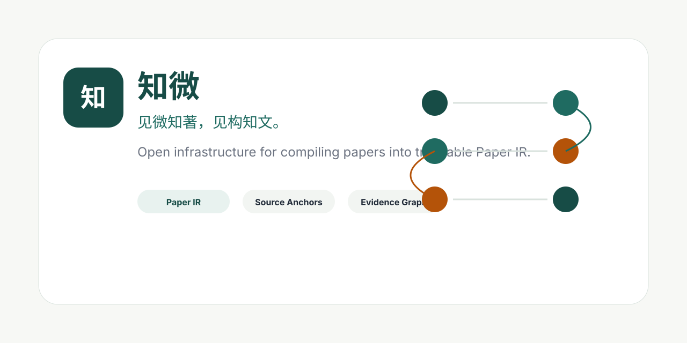

# 知微

<p align="center">
  
</p>

> 见微知著，见构知文。
> To see the small is to approach the whole.

知微不是一个普通的论文阅读器。

它是一座为复杂知识修建的桥：
把人类最精密、最艰深、最昂贵的思想成果，重新编译成可理解、可追溯、可交互、可共享的知识结构。

论文不应该只是 PDF。
知识不应该只属于少数受过训练、拥有语言优势、拥有学术门票的人。
那些压缩在人类科技史中的洞见，应该被更多人看见、理解、验证、继承，然后继续向前推进。

我们相信：

> 科学不是神庙里的密文。
> 科学是人类共同写下的火种。

## Why 知微 Exists

现代科学正在以前所未有的速度增长。
每一天，新的模型、新的理论、新的实验、新的系统被写进论文。
它们是人类文明最顶级的知识结晶，却常常被三重墙挡住：

- 语言的墙；
- 形式化表达的墙；
- 信息结构复杂度的墙。

知微想做的事情很简单，也很难：

> 让复杂论文被更多人真正理解，而不是被更多人收藏。

我们不满足于摘要。
不满足于翻译。
不满足于“这篇论文讲了什么”的粗浅回答。

我们想把论文拆成可以追踪的结构：

- 概念如何定义；
- 公式为什么出现；
- 实验在证明什么；
- 图表如何支撑论点；
- 假设在哪里；
- 证据链在哪里；
- 争议和局限在哪里；
- 读者如何从一个节点走到整篇文章的核心。

## What We Are Building

知微将复杂论文编译成一种新的知识界面：

- **知微·构**：重建论文的结构骨架；
- **知微·析**：解释概念、公式、图表与实验；
- **知微·证**：追踪论点与证据链；
- **知微·辨**：呈现局限、争议与可疑假设；
- **知微·验**：辅助复现、验证与实验理解；
- **知微·径**：为不同背景的学习者生成理解路径。

它不是替人“读完论文”。
它是帮助人进入论文。

> We do not replace reading.
> We make deep reading possible.

## Our Belief

Great papers are not content.
They are compressed civilizations.

A paper may contain years of labor, decades of theory, hundreds of failed attempts, and one small sentence that changes the direction of a field.

But if only a tiny group can decode it, then civilization is running with a broken transmission system.

知微试图修复这个传输系统。

我们希望有一天，一个高中生、一个独立开发者、一个非英语母语研究者、一个没有导师的人，也能站在同一篇论文面前，沿着清晰的结构路径走进去。

不是被喂答案。
而是获得理解复杂知识的能力。

## Open Infrastructure for Open Understanding

知微将作为开源的学术基础设施建设。

我们希望它未来不只服务中文用户。
我们希望志愿者、研究者、工程师和学习者一起，把它扩展到更多语言：

- English
- 中文
- Español
- Français
- Deutsch
- 日本語
- 한국어
- العربية
- हिन्दी
- Português
- and more.

因为知识不应该被语言切成孤岛。

> The frontier of science should not be locked behind one language.

## Our Slogans

> 见微知著，见构知文。
> See the structure. Understand the paper.

> 论文不是 PDF，论文是思想的压缩包。
> A paper is not a PDF. It is compressed thought.

> 让知识穿过语言，穿过门槛，抵达更多人。
> Let knowledge cross language, class, and gatekeeping.

> 不只是阅读论文，而是进入论文。
> Not just reading papers. Entering them.

> 科学属于愿意理解它的人。
> Science belongs to everyone who dares to understand.

> 把人类智慧从密文中释放出来。
> Release human intelligence from sealed text.

## What 知微 Is Not

知微不是论文代读工具。
不是投机取巧的摘要机器。
不是把复杂知识压扁成几句“人话”的信息快餐。

我们尊重复杂性。

真正的理解不是消灭复杂性，而是为复杂性建立路径。

知微要做的不是让人误以为自己懂了，
而是让人真的有机会懂。

## For Contributors

如果你相信知识应该被更多人理解，欢迎加入。

你可以贡献：

- 论文解析模板；
- 多语言翻译；
- 交互式图表；
- 公式解释模块；
- 学科知识路径；
- 原文回溯工具；
- benchmark 与评估集；
- 前端界面；
- 教程与文档；
- 面向不同语言社区的本地化版本。

这不是一个人的项目。
如果它要成为真正的学术基础设施，它必须属于更多人。

## The Long View

我们并不只是在做一个工具。

我们想参与一件更长远的事情：

> 降低人类理解自身知识遗产的门槛。

科学史不是由少数天才孤立推进的。
它是一代又一代中二病、理想主义者、工程师、数学家、实验者、失败者和不肯放弃的人，把看似不可能理解的东西，一点点拆开、证明、改写、传下去。

知微希望成为这条链上的一个小环。

很小。
但认真。

---

**知微**
For papers.
For learners.
For the unfinished project of human understanding.

## Live Preview

```text
https://zhiwei-lyart.vercel.app
```

当前主站支持中文 / English 两种界面语言。论文内容来自 Paper IR；界面语言切换不改变原始 IR。

## Open Protocols

知微第一阶段沉淀以下可复用协议和基础组件：

- Paper IR schema
- Source Anchor schema
- Formula IR schema
- Claim-Evidence schema
- Experiment Matrix schema
- Reproduction Roadmap schema
- IR-driven renderer
- 示例论文 benchmark

核心 schema 位于：

```text
packages/paper-ir/schemas/
```

## Built-in Examples

第一批内置示例以 JSON Paper IR 形式存在于 `examples/`，前端只读取 IR 并渲染，不把论文内容写死在 UI 组件里。

- Attention Is All You Need
- LoRA: Low-Rank Adaptation of Large Language Models
- Retrieval-Augmented Generation for Knowledge-Intensive NLP Tasks
- Direct Preference Optimization

Mimo pipeline 生成的第一批 benchmark Paper IR 位于：

```text
samples/benchmark/generated/
```

当前包括：

- Attention Is All You Need
- LoRA
- Retrieval-Augmented Generation
- Direct Preference Optimization
- Training language models to follow instructions with human feedback
- BERT
- ReAct
- CLIP

## Monorepo Structure

```text
zhiwei/
  apps/
    web/          # Web renderer and product shell
    api/          # Serverless API adapter
    api-python/   # Local Python API server
  packages/
    paper-ir/     # Open Paper IR schemas
    parser/       # PDF -> document blocks / source anchors
    extractor/    # document blocks -> Paper IR
    renderer/     # IR-driven rendering helpers
    benchmark/    # benchmark and dataset generation tools
    playground/   # experiments
  examples/
    attention-is-all-you-need/
    lora/
    rag/
    dpo/
  docs/
    paper-ir-spec.md
    anchor-spec.md
    formula-ir-spec.md
    claim-evidence-spec.md
    experiment-matrix-spec.md
    reproduction-roadmap-spec.md
    contributing.md
    roadmap.md
```

Root-level `api/`, `static/`, and `backend/` are currently kept as compatibility entrypoints for the local server and Vercel preview. The open-source source layout lives under `apps/` and `packages/`.

## Local Run

```powershell
cd C:\Users\PC\zhiwei
.\start.ps1
```

Open:

```text
http://127.0.0.1:8765
```

## Pipeline

Current pipeline:

```text
PDF
  -> Document Blocks
  -> Source Anchors
  -> Paper IR extraction
  -> Grounding verification
  -> Renderer
  -> Export
```

Mimo/OpenAI-compatible extraction is configured through:

```text
OPENAI_API_KEY=...
OPENAI_BASE_URL=...
OPENAI_MODEL=...
```

The extractor must return strict JSON and cite source anchors. Unknown details must stay unknown; inferred formula variables must carry confidence.

## Development Checks

```powershell
node --check apps\web\static\app.js
node --check static\app.js
node --check api\_demo.js
node --check apps\api\_demo.js
```

Python checks:

```powershell
python -m py_compile backend\benchmark_pipeline.py backend\semantic_ml_pipeline.py
```

## License

Apache-2.0. See `LICENSE`.
